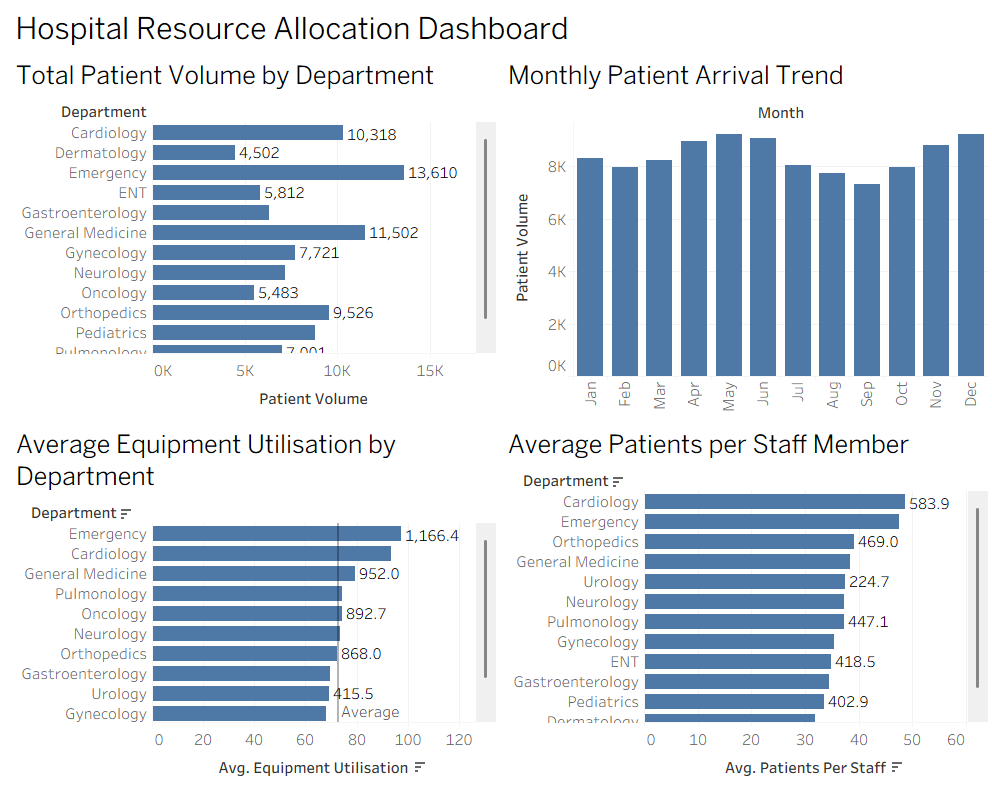

# 🏥 Hospital Resource Allocation Analysis

## 📌 Project Overview

A multi-speciality hospital wants to allocate staff and resources more effectively using data-driven analysis.

This project analyses department-wise patient volume, average treatment duration, staff availability, and equipment utilisation over a one-year period. The objective is to identify departments experiencing high resource pressure and provide a data-backed resource allocation proposal.

---

## 🎯 Problem Statement

The hospital currently distributes resources largely based on historical assumptions.

This project aims to analyse hospital data to identify:

- Departments with high patient demand
- Departments with consistently high equipment utilisation
- Seasonal variations in patient arrivals
- Departments with high patients-per-staff ratios
- Differences in resource utilisation between departments
- Factors associated with high resource utilisation

---

## 🎯 Objectives

- Clean and validate the dataset
- Perform exploratory data analysis
- Analyse department-wise patient demand
- Investigate monthly and seasonal patient variations
- Calculate staff-to-patient ratios
- Compare equipment utilisation between departments
- Perform statistical significance testing
- Build a Random Forest model
- Evaluate the machine learning model
- Create Tableau visualisations
- Provide a practical resource allocation proposal

---

## 📊 Dataset

The dataset contains **150 records** representing hospital department activity across the year.

### Dataset Features

| Column | Description |
|---|---|
| `Month` | Month of observation |
| `Department` | Hospital department |
| `Patient_Volume` | Number of patients |
| `Average_Treatment_Duration` | Average treatment duration |
| `Staff_Count` | Number of available staff |
| `Equipment_Utilisation` | Equipment utilisation percentage |

### Derived Feature

A new feature called `Patients_Per_Staff` was calculated:

```text
Patients_Per_Staff = Patient_Volume / Staff_Count
```

This helps measure the workload handled by each staff member.

---

## 🛠️ Technologies Used

- 🐍 Python
- 🐼 Pandas
- 🔢 NumPy
- 📊 SciPy
- 🤖 Scikit-learn
- ☁️ Google Colab
- 📈 Tableau
- 🐙 GitHub

---

## 🔄 Project Workflow

```text
Dataset
   ↓
Data Cleaning & Validation
   ↓
Exploratory Data Analysis
   ↓
Feature Engineering
   ↓
Statistical Analysis
   ↓
Tableau Visualisation
   ↓
Random Forest Model
   ↓
Model Evaluation
   ↓
Key Insights
   ↓
Resource Allocation Proposal
```

---

## 🧹 Data Cleaning & Validation

The dataset was checked for:

- Missing values
- Duplicate records
- Invalid numerical values
- Negative patient volumes
- Invalid treatment durations
- Invalid staff counts
- Equipment utilisation outside the valid range

The cleaned dataset was then used for further analysis.

---

## 🔍 Exploratory Data Analysis

The following analyses were performed:

### Patient Demand

Department-wise patient volume was analysed to identify departments handling larger numbers of patients.

### Equipment Utilisation

Average equipment utilisation was compared across departments to identify departments operating under higher equipment pressure.

### Staff Workload

Patients-per-staff ratios were calculated to understand workload differences between departments.

### Seasonal Analysis

Monthly patient volumes were analysed to identify periods of increased or decreased patient demand.

---

## 📈 Statistical Analysis

A **One-Way ANOVA** was performed to determine whether equipment utilisation differs significantly between hospital departments.

### Hypotheses

**Null Hypothesis (H₀):**

> There is no significant difference in equipment utilisation between departments.

**Alternative Hypothesis (H₁):**

> At least one department has significantly different equipment utilisation.

The F-statistic and p-value obtained from the analysis are reported in the project notebook.

---

# 📊 Tableau Dashboard

Four major visualisations were created using Tableau.

### 1. Patient Volume by Department

Shows the total patient demand across departments.

### 2. Monthly Patient Arrival Trend

Shows how patient volume changes throughout the year and helps identify seasonal patterns.

### 3. Equipment Utilisation by Department

Compares average equipment utilisation between departments.

### 4. Patients per Staff Member

Shows the workload per staff member across departments.

### Dashboard Preview



---

# 🤖 Machine Learning

## Random Forest

A **Random Forest Classification** model was developed to identify records associated with high equipment utilisation.

### Prediction Target

```text
High_Equipment_Utilisation
```

The target identifies whether equipment utilisation reaches the selected high-utilisation threshold.

### Features Used

- Month
- Department
- Patient Volume
- Average Treatment Duration
- Staff Count

Categorical variables were encoded before model training.

---

## 📏 Model Evaluation

The Random Forest model was evaluated using:

- Accuracy
- Precision
- Recall
- F1 Score
- Confusion Matrix
- Feature Importance

### Results

| Metric | Result |
|---|---:|
| Accuracy | TBD |
| Precision | TBD |
| Recall | TBD |
| F1 Score | TBD |

> The final values will be updated after model training and evaluation.

---

# 🔑 Key Insights

1. **Emergency showed high resource pressure**, with high patient demand and high equipment utilisation in the analysed dataset.

2. **Cardiology showed consistently high equipment utilisation**, indicating sustained demand for equipment resources.

3. **General Medicine handled a high patient volume**, making it an important department for resource planning.

4. **Patient arrivals varied across months**, indicating seasonal changes in hospital demand.

5. **Emergency and Cardiology showed relatively high patients-per-staff ratios**, indicating higher workload pressure.

6. **Equipment utilisation differed between departments**, which was investigated using statistical analysis.

7. **Resource allocation should consider multiple factors**, including patient volume, staff workload, treatment duration and equipment utilisation rather than patient volume alone.

---

# 🏥 Resource Allocation Proposal

Based on the analysis:

### Emergency Department

- Consider additional staffing during high-demand periods.
- Closely monitor equipment availability.
- Prepare additional capacity during peak patient-arrival periods.

### Cardiology

- Monitor consistently high equipment utilisation.
- Evaluate staffing levels based on patient workload.
- Review equipment capacity if high utilisation continues.

### High-Demand Periods

- Plan additional staffing capacity.
- Ensure availability of critical equipment.
- Use historical monthly patterns for future resource planning.

### Lower-Utilisation Departments

- Review resource utilisation.
- Consider flexible resource allocation where operationally appropriate.

> Final resource allocation decisions should also consider clinical requirements, patient safety, staffing regulations, and hospital management policies.

---

# 📁 Project Structure

```text
Hospital_Resource_Allocation_Analysis/
│
├── README.md
│
├── data/
│   └── hospital_resource_allocation_mock_150.csv
│
├── notebooks/
│   └── Hospital_Resource_Allocation.ipynb
│
├── tableau/
│   └── hospital_resource_dashboard.twbx
│
├── results/
│   ├── processed_hospital_data.csv
│   └── feature_importance.csv
│
└── images/
    └── hospital_resource_dashboard.png
```

---

# 🚀 How to Run the Project

## 1. Clone the Repository

```bash
git clone https://github.com/PRIYA-P14/Hospital_Resource_Allocation_Analysis.git
```

## 2. Open the Google Colab Notebook

Upload/open:

```text
Hospital_Resource_Allocation.ipynb
```

## 3. Upload the Dataset

Place the dataset in the appropriate Google Drive folder and update the file path in the notebook.

## 4. Run the Notebook

Execute the cells sequentially for:

- Data cleaning
- EDA
- Feature engineering
- Statistical analysis
- Random Forest training
- Model evaluation

## 5. Open the Tableau Dashboard

Open the Tableau workbook to explore the four visualisations.

---

# ✅ Conclusion

This project demonstrates how hospital resource allocation can be supported using:

- Data analysis
- Statistical testing
- Machine learning
- Interactive visualisation

By combining patient demand, staffing workload and equipment utilisation, the project provides a data-driven approach to identifying departments and periods that may require additional resources.

---
